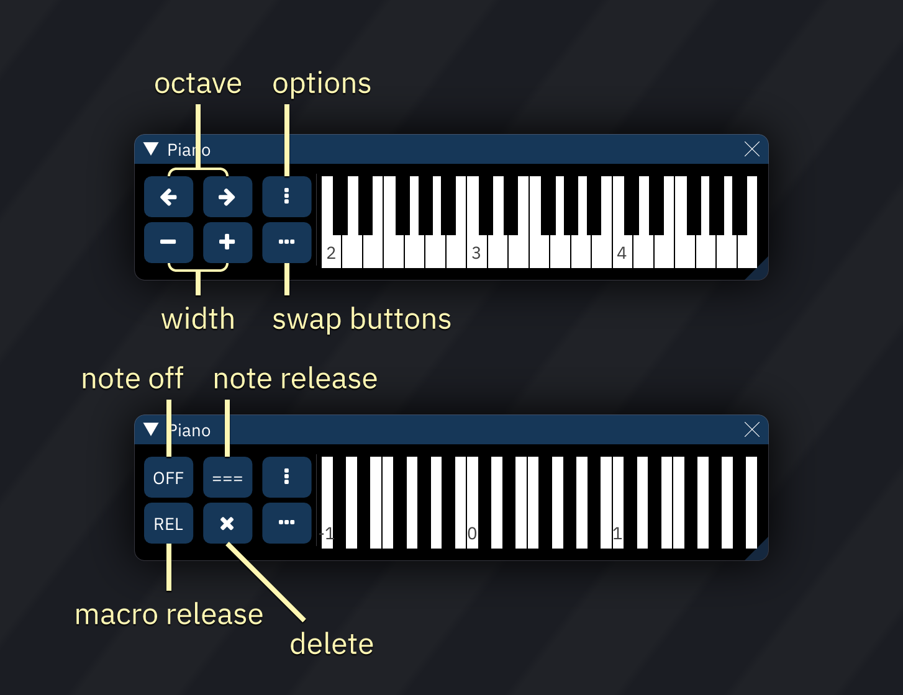

# piano / input pad

The piano serves as a non-keyboard interface to input notes.

The buttons at the left do the following:

|  |  |  |
| :---: | :---: | :---: |
| move one octave down | move one octave up | open options |
| fewer visible octaves | more visible octaves | swap buttons |

When swapped, the bottons do the following:

|  |  |  |
| :---: | :---: | :---: |
| input note off | input note release | open options |
| input macro release | delete | swap buttons |

Every C key is labelled with its octave.

Right-clicking on the piano keys will make the buttons disappear; right-clicking again brings them back.

## options

Key layout:
- [Automatic]
- [Standard]: Black keys are 2/3 length.
- [Continuous]: Black keys are full length.

Value input pad: (document this)
- [Disabled]
- [Replace piano]
- [Split (automatic)]
- [Split (always visible)]

[Share play/edit offset/range]: (document this)
